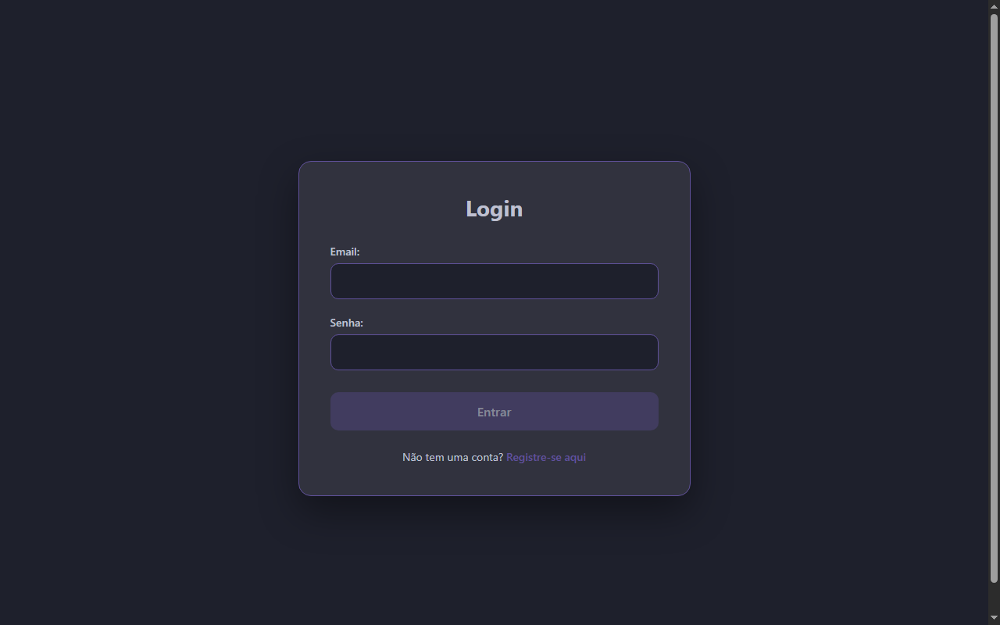
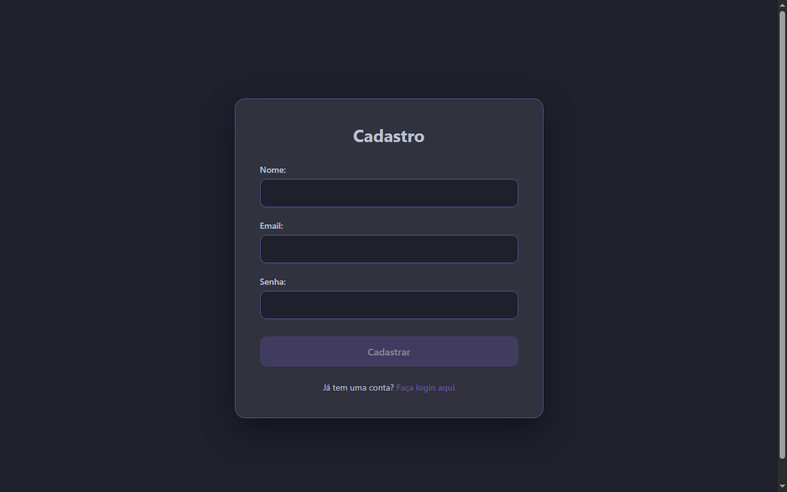
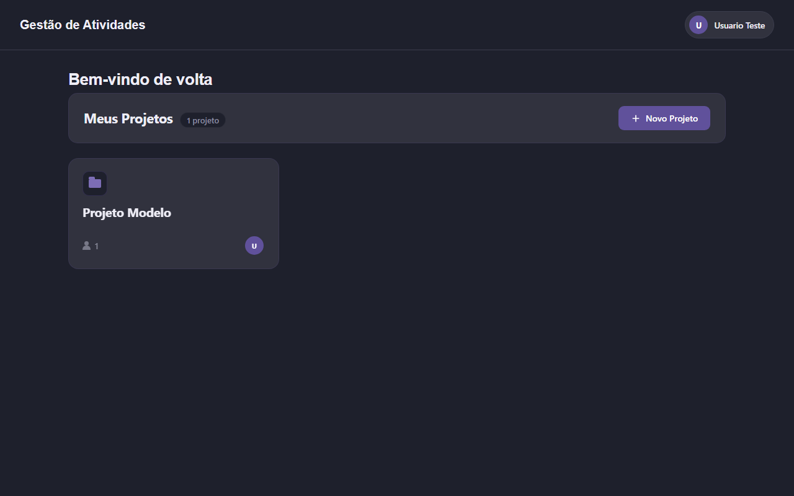
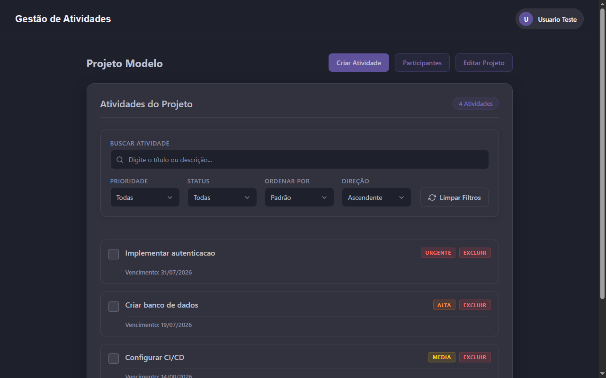
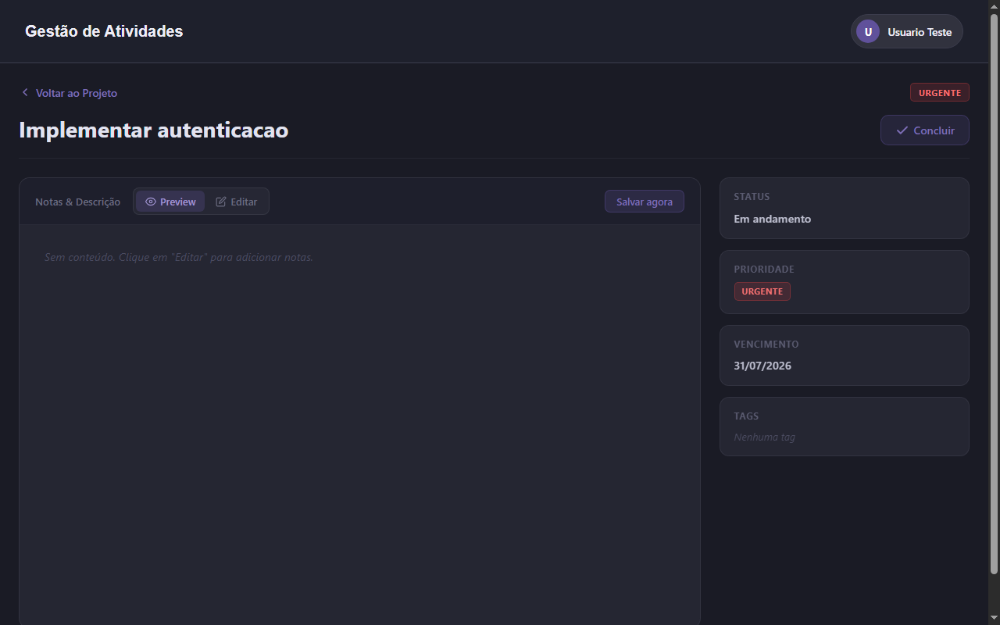

# Gestao de Atividades Frontend

Interface web para o sistema colaborativo de gerenciamento de atividades, construida com Angular 22.

## O que e o projeto

O **Gestao de Atividades Frontend** e a interface de usuario da API de mesmo nome. A aplicacao permite que equipes organizem e acompanhem o andamento de tarefas dentro de projetos compartilhados, com autenticacao via JWT, prioridades, prazos, subtarefas e tags.

O frontend consome uma API RESTful publica disponivel em:

[https://github.com/Murilo-Barbiere/Gestao-de-atividades-API](https://github.com/Murilo-Barbiere/Gestao-de-atividades-API)

## Screenshots

### Login



### Cadastro



### Pagina inicial (projetos)



### Projeto com atividades



### Detalhes da atividade



## Funcionalidades

- **Autenticacao de usuarios** com registro, login e protecao de rotas via AuthGuard
- **Gerenciamento de projetos** com criacao, edicao e exclusao
- **Gerenciamento de participantes** nos projetos (adicionar e remover membros por email)
- **CRUD de atividades** com:
  - Prioridade: `URGENTE`, `ALTA`, `MEDIA`, `BAIXA`
  - Data de vencimento com indicacao de atividades vencidas
  - Hierarquia entre atividades (subtarefas)
  - Associacao de tags
  - Editor de texto com suporte a **Markdown** (codigo, listas, checkboxes, links, headers, blockquotes)
- **Filtros e ordenacao** na listagem de atividades por status, prioridade, data e texto
- **Painel lateral** com informacoes detalhadas da atividade (prioridade, prazo, tags, subtarefas)
- **Interface responsiva** com tema escuro seguindo paleta de cores definida

## Tecnologias

- [Angular 22](https://angular.dev/) com componentes standalone
- [TypeScript](https://www.typescriptlang.org/)
- [Angular Router](https://angular.dev/guide/routing) para navegacao entre paginas
- [Angular Reactive Forms](https://angular.dev/guide/forms/reactive-forms) para formularios
- [Angular HttpClient](https://angular.dev/guide/http) para comunicacao com a API
- [RxJS](https://rxjs.dev/) para programacao reativa
- [jwt-decode](https://github.com/auth0/jwt-decode) para decodificacao de tokens JWT
- [Font Awesome](https://fontawesome.com/) para icones

## Paginas e rotas

| Rota | Pagina | Descricao |
|---|---|---|
| `/login` | LoginPage | Autenticacao de usuario |
| `/register` | RegisterPage | Cadastro de novo usuario |
| `/home` | HomePage | Listagem de projetos do usuario |
| `/projeto/:id` | ProjetoPage | Atividades de um projeto especifico |
| `/atividade/:id` | AtividadePage | Detalhes e edicao de uma atividade |

## Como usar

### Pre-requisitos

- [Node.js](https://nodejs.org/) 18 ou superior
- A API backend rodando (veja o repositorio da API para instrucoes)

### Instalacao

1. Clone o repositorio:

   ```bash
   git clone https://github.com/Murilo-Barbiere/Gestao-de-atividades-front.git
   cd Gestao-de-atividades-front
   ```

2. Instale as dependencias:

   ```bash
   npm install
   ```

3. Inicie o servidor de desenvolvimento:

   ```bash
   npm start
   ```

   A aplicacao sera aberta em `http://localhost:4200`.

### Configuracao da API

Por padrao, o frontend aponta para `http://localhost:3000` (endereco da API local). Para alterar, edite o arquivo `src/environments/environment.development.ts`:

```typescript
export const environment = {
  production: false,
  apiUrl: 'http://localhost:3000'
};
```

## Estrutura do projeto

```
src/
├── app/
│   ├── components/
│   │   ├── atividade-card/
│   │   ├── atividade-create-popup/
│   │   ├── atividade-info-sidebar/
│   │   ├── atividade-lista/
│   │   ├── atividade-page-header/
│   │   ├── atividade-texto-editor/
│   │   ├── home-header/
│   │   ├── home-header-lista/
│   │   ├── lista-projeto/
│   │   ├── participante-popup/
│   │   ├── projeto-busca/
│   │   ├── projeto-card/
│   │   ├── projeto-create-popup/
│   │   ├── projeto-edit-popup/
│   │   ├── user-button/
│   │   └── user-popup/
│   ├── core/
│   │   ├── guards/
│   │   ├── interface/
│   │   ├── services/
│   │   │   ├── auth.service.ts
│   │   │   ├── atividades.service.ts
│   │   │   ├── projetos.service.ts
│   │   │   ├── tags.service.ts
│   │   │   └── user.service.ts
│   │   └── utils/
│   │       └── markdown-renderer.ts
│   └── pages/
│       ├── atividade/
│       ├── home/
│       ├── login/
│       ├── projeto/
│       └── register/
├── environments/
├── index.html
├── main.ts
└── styles.css
```

## Componentes principais

A aplicacao segue o principio de composicao de componentes pai e filho, com paginas que orquestram componentes menores e reutilizaveis:

- **HomePage** → `HomeHeader` + `ListaProjeto` (que renderiza `HomeHeaderLista`, `ProjetoCard` e popups)
- **ProjetoPage** → `HomeHeader` + `AtividadeListaComponent` + popups (editar projeto, criar atividade, participantes)
- **AtividadePage** → `HomeHeader` + `AtividadePageHeader` + `AtividadeTextoEditor` + `AtividadeInfoSidebar`

## Estilo visual

O projeto utiliza uma paleta de cores escura e consistente com fundo navy escuro (`#1e202c`), cards em cinza escuro (`#31323e`) e tons de roxo (`#60519b`) como cor de destaque. Todos os popups sao tratados como cards estilizados seguindo o mesmo design system.
